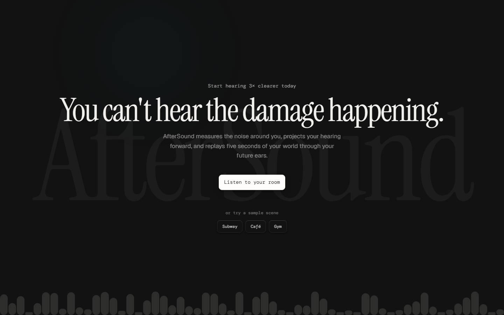
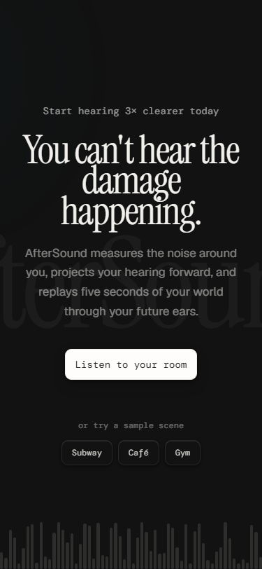

# AfterSound

> You can't hear the damage happening. Now you can.

AfterSound measures the noise around you, projects your hearing forward, and
replays five seconds of your own audio through your projected future ears —
so the damage is audible before it's irreversible.

**Live demo:** https://aftersound-fawn.vercel.app

## What it does

1. **Measure your room** — Click "Listen to your room" (or try a sample scene).
   The app shows a live A-weighted dB readout, a real-time spectrum, and your
   NIOSH safe daily exposure time. Simultaneously, it captures 5 seconds of
   audio.

2. **Hear the future** — The captured audio plays back clean, then replays
   through a projected hearing loss filter chain. An audiogram draws itself
   showing the projected loss. Drag the age and exposure sliders to see the
   projection change live.

3. **Test your actual ears** — A 90-second adaptive staircase hearing test
   measures your real thresholds at 1 kHz and 4 kHz, then overlays them on
   the projection.

## How it works — the three DSP subsystems

### 1. A-weighted LAeq sound level meter (AudioWorklet)

An `AudioWorkletProcessor` applies A-weighting (IEC 61672-1 approximation:
4 cascaded biquads — 2 highpass at 20.6 Hz + 2 lowpass at 12.2 kHz) to the
input signal, computes instantaneous SPL, and does exponential averaging
in the linear energy domain (1-second "slow" time constant). The NIOSH
dose calculation uses the 3 dB exchange rate: `T = 8 / 2^((L - 85) / 3)`.

Files: `public/worklets/spl-meter-processor.js`, `src/lib/audio/meter.ts`,
`src/lib/audio/niosh.ts`

### 2. NIPTS projection + resynthesis filter chain

The projection model computes Noise-Induced Permanent Threshold Shift at
each audiometric frequency using a formula tuned to produce values
consistent with NIOSH 98-126 data. The resynthesis engine applies the
audiogram as a multiband biquad peaking filter chain, with Q widening to
model spectral smearing (loss of cochlear frequency selectivity), plus a
highshelf and dynamic lowpass for broad high-frequency rolloff. When
average loss exceeds 15 dB, a tinnitus layer is mixed in: a faint 4 kHz
pure tone (the most common tinnitus pitch in noise-induced hearing loss)
plus low-level broadband noise simulating the raised noise floor and
reduced dynamic range that accompany cochlear damage.

**Disclaimer:** The NIPTS formula is our own approximation, not the ISO
1999 standard (which is paywalled). It captures the general shape of
noise-induced hearing loss but is not suitable for clinical risk
assessment.

Files: `src/lib/audio/nipts.ts`, `src/lib/audio/resynthesis.ts`

### 3. Adaptive staircase audiometry

A 2-down/1-up staircase (Levitt, 1971) converges on the 70.7% correct
threshold. Step sizes start at 5 dB and reduce to 2 dB after the first
reversal. Threshold = average of the last 4 reversal points. Tones use
RETSPL calibration values from ISO 389-7.

**Disclaimer:** This is not a clinical audiometer. Results depend on
headphone calibration, background noise, and response honesty.

Files: `src/lib/audio/staircase.ts`, `src/lib/audio/tone-generator.ts`,
`src/components/ear-test.tsx`

## Tech stack

- **Next.js 16.3.1** (App Router) + **TypeScript 5.9.3**
- **Tailwind CSS 4.3.3**
- **audiomotion-analyzer 4.5.4** — real-time spectrum visualization (AGPL-3.0)
- **GSAP 3.15.0** + **@gsap/react 2.1.2** — animation (GreenSock standard licence)
- **Web Audio API** — AudioWorklet, AnalyserNode, biquad filters, oscillators

All versions pinned exactly. Fully client-side — no backend, no database,
no API keys, no accounts.

## Honest limitations

- **Sound level:** The dB reading is uncalibrated. Consumer microphones vary
  ±15-20 dB from professional equipment. Use it to compare environments, not
  as an absolute measurement.
- **Hearing loss projection:** The NIPTS model is our own approximation, not
  ISO 1999. Not for clinical or risk assessment use.
- **Ear test:** Not a clinical audiometer. Results depend on headphones and
  environment. See an audiologist for real assessment.
- **Resynthesis:** Models frequency attenuation, spectral smearing, tinnitus
  (4 kHz ringing), and reduced dynamic range (raised noise floor). Real
  hearing loss also involves temporal smearing and loudness recruitment —
  not simulated here.

## AI assistance disclosure

This project was built with assistance from Devin (Cognition), an AI coding
agent. The AI was used for code generation, debugging, and project planning.
All code was reviewed and deployed by the human developer.

## License

GNU AGPL-3.0-or-later. See [LICENSE](./LICENSE).

### Third-party licences

- [audiomotion-analyzer](https://github.com/hvianna/audiomotion-analyzer) —
  AGPL-3.0-or-later (this is why the project is AGPL, not MIT)
- [GSAP](https://gsap.com) — GreenSock standard "no charge" licence (not MIT)
- NIOSH criteria document DHHS 98-126 — public domain

## Acknowledgements

- NIOSH DHHS 98-126 for the noise exposure criteria and dose calculations
- Levitt (1971) for the adaptive staircase methodology
- ISO 389-7 for RETSPL calibration reference values
